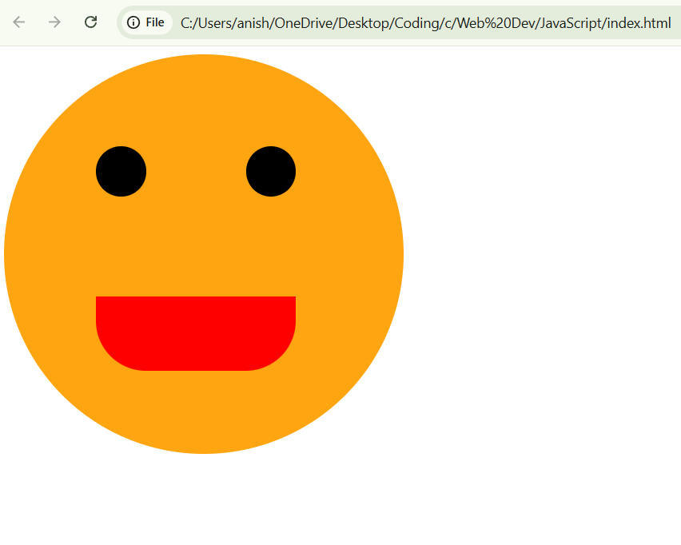

# Smiley Face using HTML and CSS 😊

This is a simple smiley face design created using HTML and CSS.

## Features
- Created using pure HTML and CSS
- Beginner-friendly project
- Clean and simple design
- Shows use of basic CSS shapes and styling

## Technologies Used
- HTML
- CSS

## Preview

## What I Learned
- How to structure an HTML page
- How to style elements using CSS
- Applied properties like div element, margin, padding.
- Understood selector specificity. 
- How to upload a project on GitHub

## Live Website Link
 https://anisha11-star.github.io/Smiley-face/

## Author
Anisha Kumari
